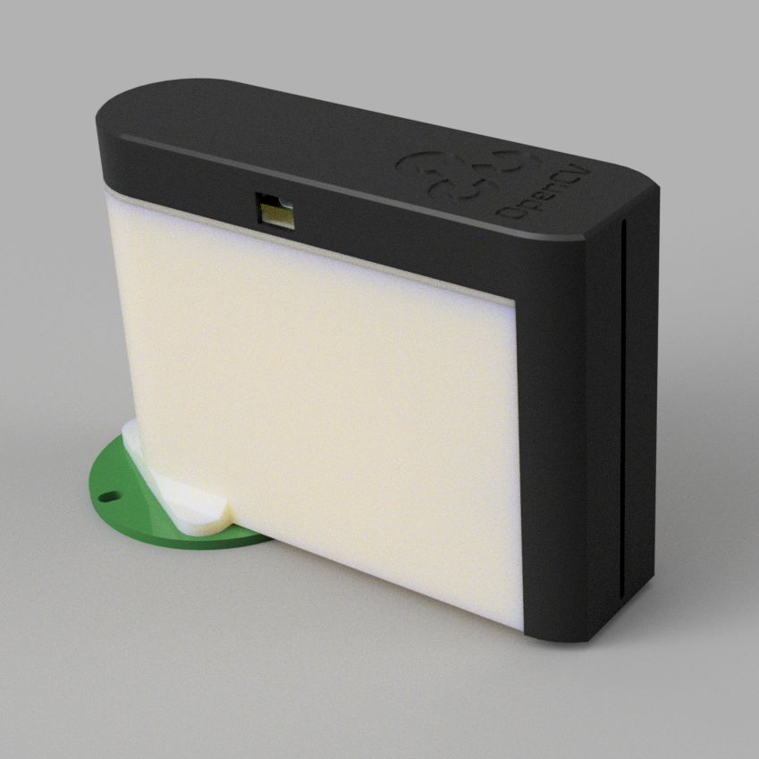
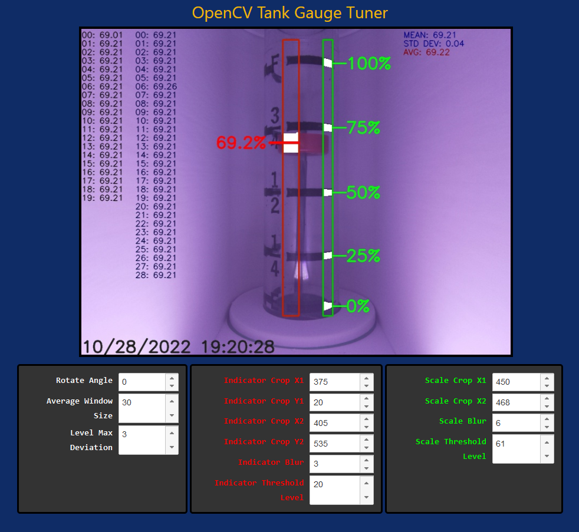

## OpenCV Oil Tank Gauge Reader

- Raspberry Pi Zero W with Official Raspberry Pi Camera 2
- Custom 3D printed enclosure and mount
- Mount uses magnets for quick removal for maintenance or service
- RGB NeoPixel-style gauge display on front of gauge
- Browser-based computer vision parameter tuning with real-time live preview
- Home Assistant API integration
- REST API

